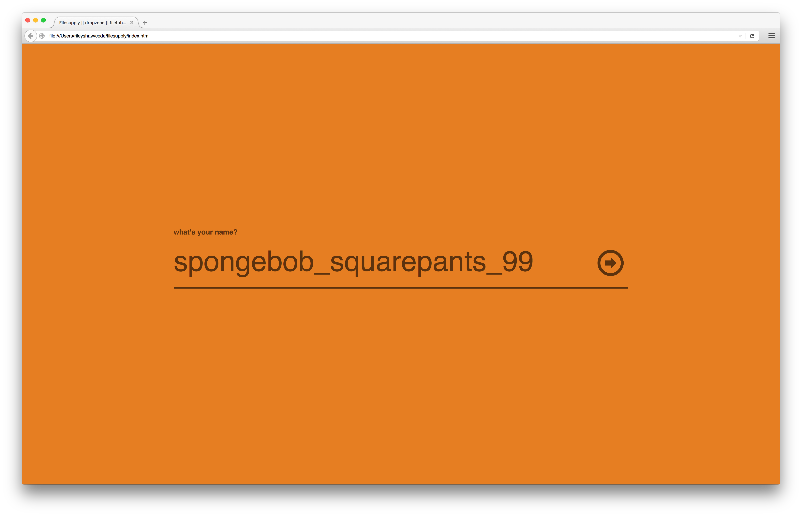
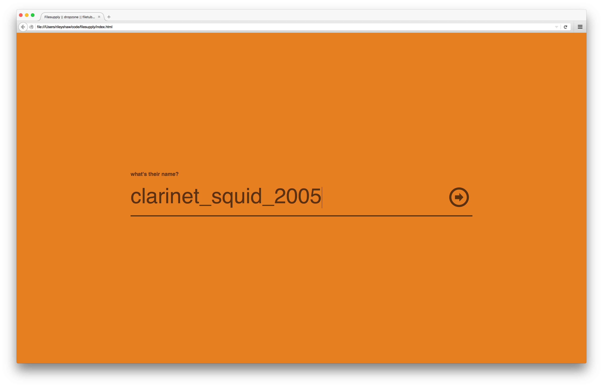
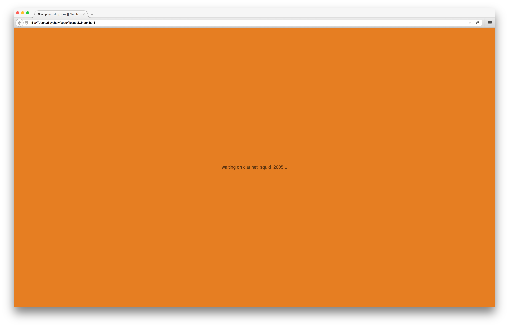
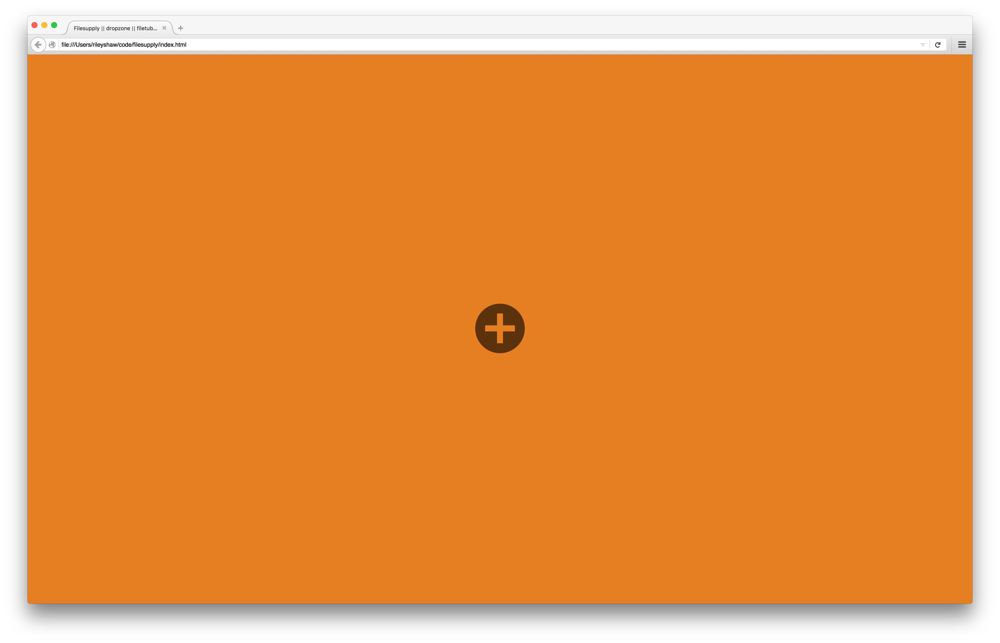
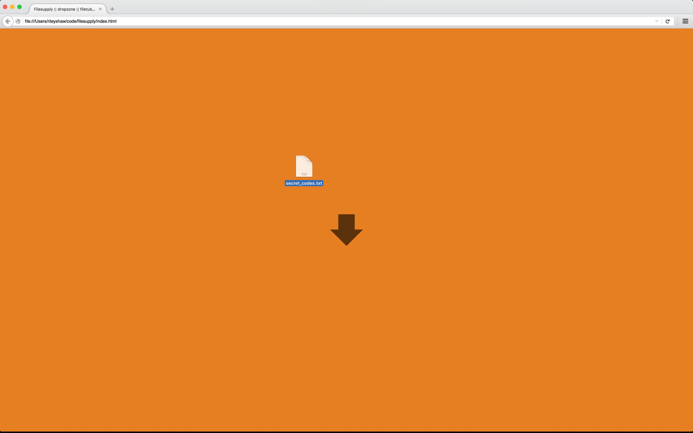
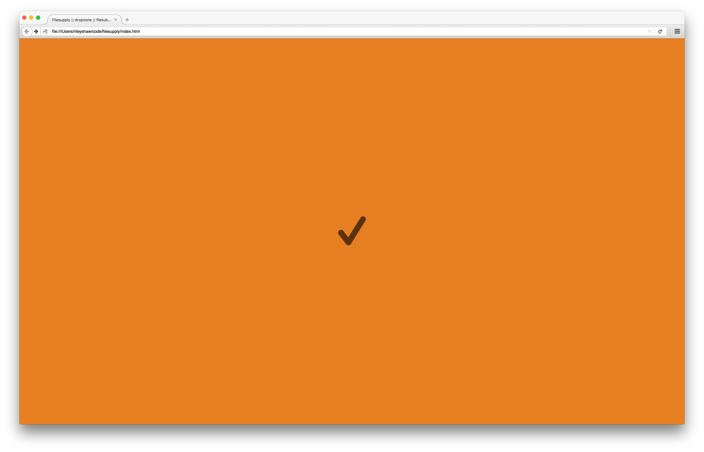

# filesupply

## what?
a "webrtc" "file" "sharing" "web" "app"


## when?
while i was waiting for a pizza to arrive in early 2014

## how?
it uses [peerjs](https://github.com/peers/peerjs/) and their hosted connection broker. if you want to run this you'll need [your own key](http://peerjs.com/peerserver).

the interaction looks like this:








then clarinet_squid_2005 gets the binary dumped to their console because my pizza arrived.

from the code:

```
// (this is possible since every human goes by a unique name)
```

f.a.q.

it was delicious thanks
